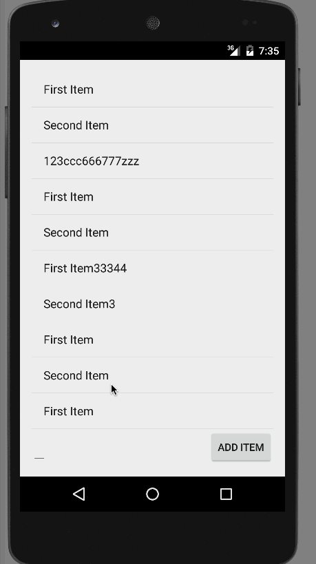

# appboot_project_0
[Android Bootcamp] Project 0: TodoList

# TodoList Demo

Completed user stories:

 * [x] Can you successfully add and remove items from the todo list within your app?
 * [x] Did you include support for editing todo items as described above?
 * [x] Does your app persist todo items and retrieve them properly on app restart?
 * [x] Did you successfully push your code to github? Can you see the code on github?
 * [x] Did you add a README which includes a GIF walkthrough of the app's functionality?
 * [x] Did you create an issue on the repo and include /cc @codepathreview @codepath in the issue body?
 
Notes:

Walkthrough of all user stories:

GIF created with [LiceCap](http://www.cockos.com/licecap/).

